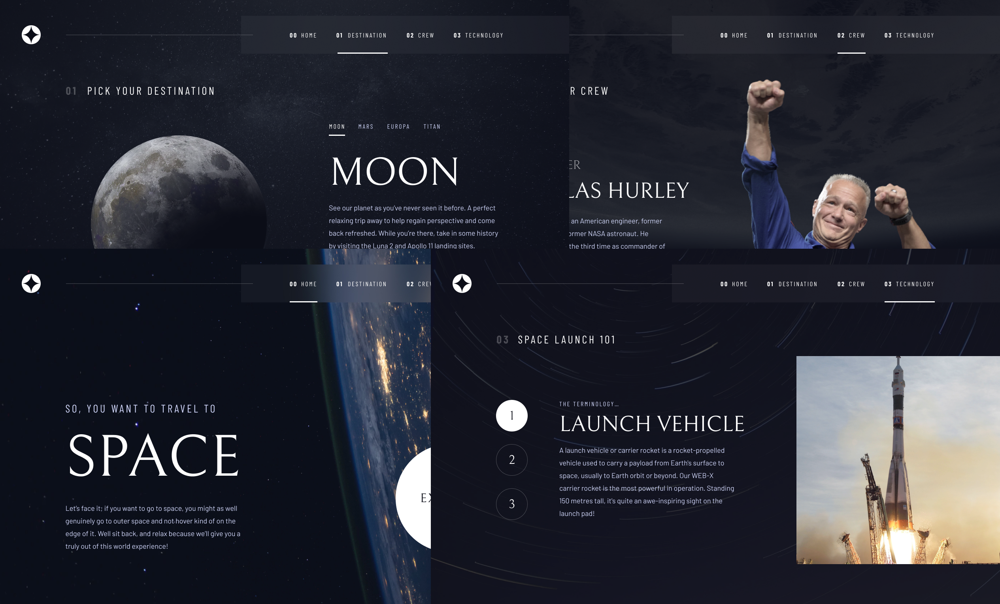

# Space tourism multi-page website

This landing page has been made as a challenge from [Frontend Mentor](https://www.frontendmentor.io/challenges/space-tourism-multipage-website-gRWj1URZ3).



## What I've learned

* [react-spring](https://react-spring.io/)
* [Custom React hooks](https://reactjs.org/docs/hooks-custom.html)

### react-spring

```js
  const location = useLocation();
  const transitions = useTransition(location, {
    from: { opacity: 0},
    enter: { opacity: 1},
  });

  return transitions((props, item) => (
    <>
      <animated.div style={props}>

              ...

      </animated.div>
    </>
  ));
```

### Custom React hooks

```js
export const useImportImages = () => {
  const importAll = r => {
    return r.keys().map(r);
  }
  const images = importAll(require.context('../assets/', true, /image/));

  return images;
}
```